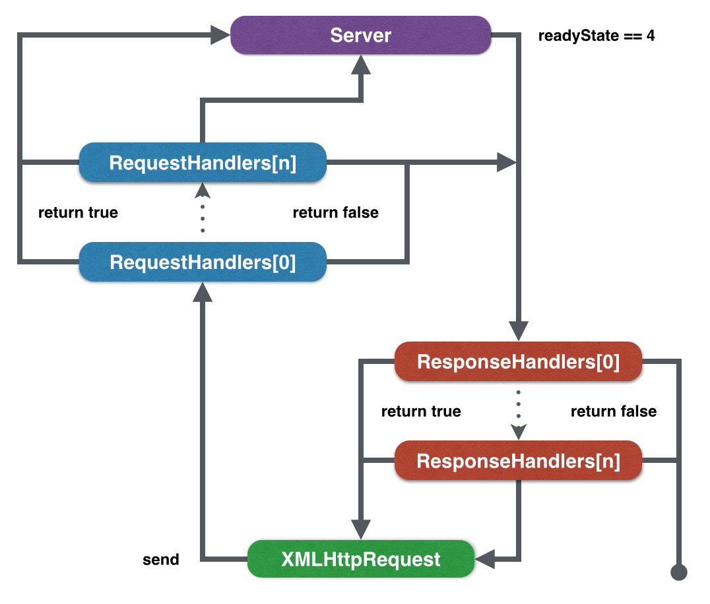

# XCeptor Project

An XHR interceptor

### Install

```bash
bower install xceptor
```

or

```bash
npm install xceptor
```

### Usage

```javascript
XCeptor.when(method, route, requestHandler, responseHandler);

XCeptor[method](route, requestHandler, responseHandler);
```

### Demo

###### 1. Fake a resource

```html
<script src="/node_modules/xceptor/xceptor.js"></script>
<script>
XCeptor.get(new RegExp('^/hello$'), (req, res) => {
  res.responseText = 'Hello XCeptor';
  return false;
});

var xhr = new XMLHttpRequest();
xhr.open('GET', '/hello');
xhr.onload = () => {
  alert(xhr.responseText);
};
xhr.send();
</script>
```

###### 2. Unify form validate

```html
<script src="/node_modules/xceptor/xceptor.js"></script>
<script>
XCeptor.post(new RegExp('^/login$'), (req, res) => { 
  var data = JSON.parse(req.data);
  if(data.password === '') {
    res.status = 400;
    res.responseText = JSON.stringify({
      "message": "Enter your password please"
    });
    return false;
  }
});

var xhr = new XMLHttpRequest();
xhr.open('POST', '/login');
xhr.onreadystatechange = () => {
  if(xhr.readyState < 4) return;
  alert(xhr.status + ', ' + JSON.parse(xhr.responseText).message);
};
xhr.send(JSON.stringify({
  username: 'YanagiEiichi',
  password: ''
}));
</script>
```

###### 3. Go to login while any 401 code responsed

```html
<script src="/node_modules/xceptor/xceptor.js"></script>
<script>
XCeptor.when(/^/, new RegExp('^/login$'), null, (req, res) => { 
  if(res.status !== 401) return;
  location.href = '/login';
});
</script>
```

### Chematic Diagram


